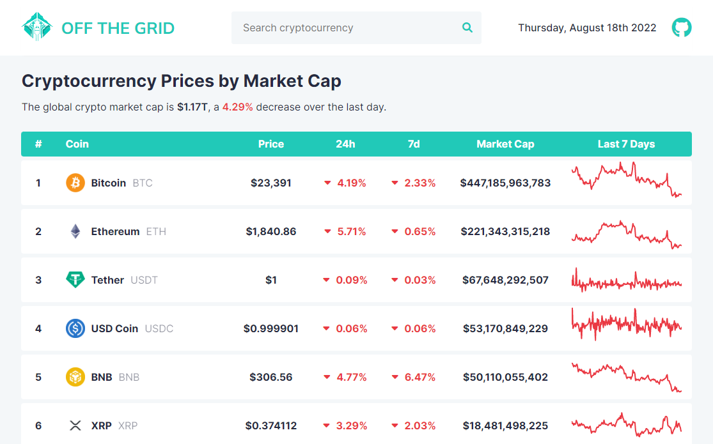
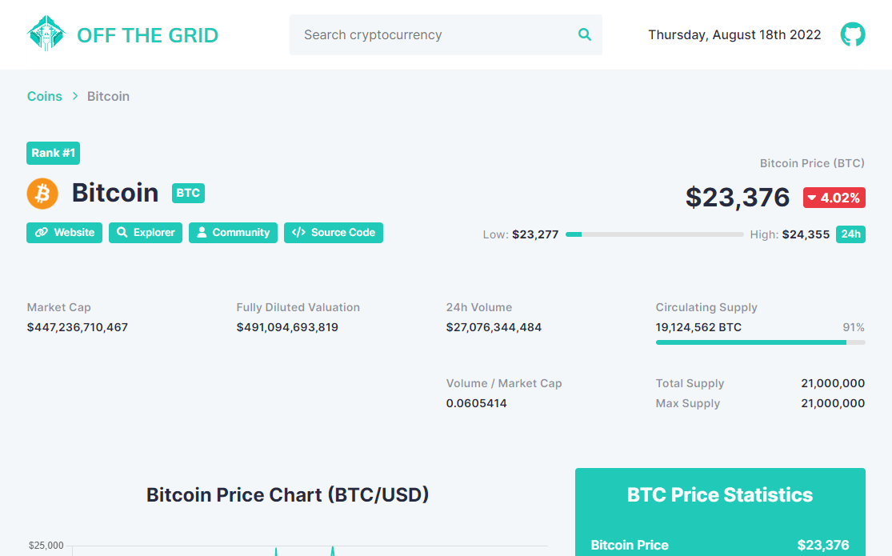
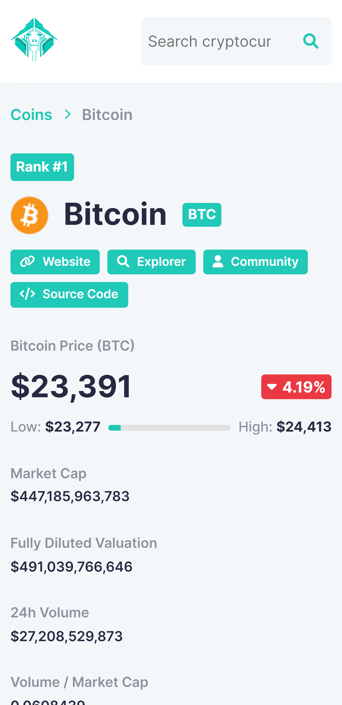

<div align="center">
  
  <h1>Off The Grid: Cryptocurrency App</h1>

  <p>
  Cryptocurrency app to keep track of price, volume and market capitalization for 13,000+ coins
  </p>

  <p>
    <a href="https://github.com/danxschz/crypto-app/graphs/contributors">
      
    </a>
    <a href="https://github.com/danxschz/crypto-app/commits/main">
      
    </a>
    <a href="https://github.com/danxschz/crypto-app/blob/master/LICENSE">
      
    </a>
  </p>

  <h4>
    <a href="https://danxschz.github.io/crypto-app">View Demo</a>
    <span> · </span>
    <a href="https://github.com/danxschz/crypto-app/issues/">Report Bug</a>
  </h4>
</div>

<br>

## About the Project

### Screenshots

<div align="center">
  <h3>Desktop</h3>
  
  
  &nbsp;
  
  

  <h3>Mobile</h3>
  
</div>

### Built With

- HTML
- CSS
- JavaScript
- Sass
- npm
- webpack
- Chart.js
- CoinGecko API

### Color Reference

| Color      | Hex     |
| :--------: | :-----: |
| Background | #F4F7F9 |
| Primary    | #21C9B8 |
| Text       | #262A41 |
| Positive   | #41D9AB |
| Negative   | #EA3943 |

## Getting Started

### Run Locally

In order to setup and work on this project on your own, you will need to:

Clone the project

```bash
  git clone https://github.com/danxschz/crypto-app.git
```

Go to the project directory

```bash
  cd crypto-app
```

Install dependencies

```bash
  npm install
```

## Usage

- Track extensive market data for thousands of cryptocurrencies such as Bitcoin, Ethereum, XRP 
- Search specific cryptocurrencies or track the top 20 coins ordered by market cap 

## License

Distributed under the MIT License. See LICENSE for more information.

## Contact

Daniel Sanchez (@danxschz) - danxschz@gmail.com
